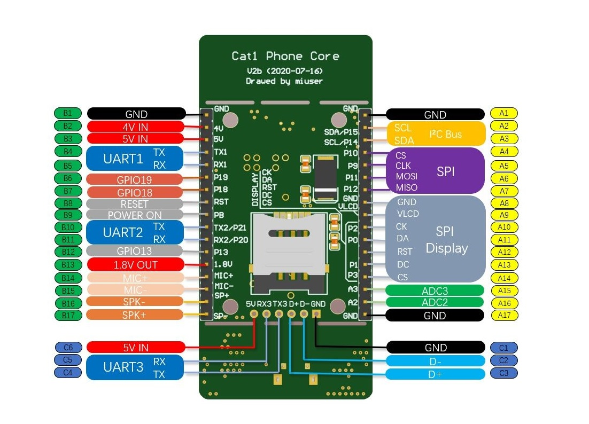

# midemo产品说明书

[TOC]

## 1 软件简介

版本 V0.3

### 1.1 概述

midemo 计划用一组极简单的AT增强指令，简化现有的物联网模块联网方式，并增强现有物联网模块对外设的控制能力。 具体功能如下：

### 1.2 基本功能

一、内置upws开源网络通讯组件，可以通过手机扫描二维码直接与模块建立通讯，收发指令

二、使用LED（极简）或 SSD1306单色点阵显示屏（推荐）展示系统运行状态

三、支持外挂320X240分辨率以下的SPI全彩显示屏和扬声器进行文字信息输出

四、支持指令控制实时外挂各种总线设备，包括传感器，执行器等，兼容SPI、UART、MODBUS等总线方式

五、支持定时指令控制

六、支持多链路连接并自动维护网络持续可用，目前支持三路同时在线，1、upws（默认内置），2、标准MQTT，3、阿里云透传

七、支持远程恢复和固件升级

### 1.3 使用环境

Midemo适用于合宙出品全系列Cat1模块，支持该模块的核心板，开发板，以及各类定制产品。代码通过Luatools烧写

推荐使用开源电话核心板Cat1 Phone Core 作为硬件平台，项目地址：https://www.oshwhub.com/miuser/elderphonev2-schdoc

### 1.4 使用方法

一、连接USB端口，安装好驱动程序，然后使用LuatoolsV2 将项目源码（midemo目录及子目录）全部烧写到目标的核心板。（商品板自带，不需要另外烧了）

二、运行二维码生成程序 M2MReader.exe，生成遥控二维码并通过手机扫码控制（商品板自带二维码标签，不需要自己打）

三、使用MiCOM发送MAT指令（名称为：LUAT USB Device 1 AT COMXX)，实现相应功能

### 1.5 下载地址

合宙Cat1 USB驱动、LuatoolsV2，串口工具，底包，脚本

https://file.miuser.net/?dir=/Luat/basic

### 1.6 基本安装步骤

一、安装驱动和LuattoolsV2，并完成自动在线更新

https://luatos.com/luatools/download/last

二、选择合宙底包，并烧写midemo开源代码,步骤如下

运行LuatoolsV2，并选择项目管理测试

	新建项目
	选择底包和脚本
	连接USB线并烧写

### 1.7 使用方法

上电后，有三种方式可以控制模块。 推荐前两种方式！

1，通过手机扫描使用工具生产的二维码。

2，使用本地USB虚拟AT串口访问模块。

3使用附带的C#demo通过UDP方式访问模块。

本DEMO采用标准的AT方式进行通讯。

举例：

	SETGPIO,13,1 		-> 设置GPIO13位高电平
	SETGPIO,13,1->OK	<- midemo回送通讯正常
	GPIOLEVEL,13,1		<- midemo回送当前GPIO13电平状态为高
	GPIOEDGE,13,1		<- midemo回送GPIO13上升沿触发状态

三、更详细的Luat开发步骤，请参考合宙官网doc系统，有详细介绍

https://doc.openluat.com/wiki/3

## 2 开发

### 2.1 基本术语

midemo的一切功能均通过指令和消息完成，指令被称为MAT，消息被称为MATR

	MAT 指令 --指用户发送给midemo的指令，全称为 Miniums Attention 
	MATR 消息--指midemo发送给用户的消息，全称为 Minimus Attention Respond

MAT和MATR采用GB2312编码，且均可以携带任意个参数，参数之间采用英文字符逗号"," 分隔，在参数和命令中逗号为保留字符禁止使用，如果确有需要，以中文逗号代替，中文逗号则用两个连续的中文逗号代替。

### 2.2 工作原理

midemo基于上海合宙luatask架构编写，使用iRTU开源物联网固件作为通讯内核，各个模块采用协作式多任务（协程）方式进行通讯。 模块拥有全球唯一的ID识别码，和唯一的MM通讯密码。 ID+MM方式实现双向收发鉴权，仅ID方式适用于单向侦听网络包，但无权发送。 ID和MM可以通过二维码生成器生成，并将在模块上电时从串口打印输出。

### 2.3 项目结构

#### 2.3.1 遥控端文件 （app目录）

	<dir> CS_UDP_demo	--C#编写的模块控制程序demo，支持通过本地串口和网络UDP方式访问upws接口控制模块
	<dir> page			--html5编写的模块控制页面，跨平台支持PC、手机、平板上的各种浏览器、微信扫一扫等

#### 2.3.2 源码文件（source目录）

	main.lua 	--入口文件
	bs.lua				--midemo模块配置文件
	<dir> LICENSE		--版权信息
	<dir> iRTU			--网络通讯组件包
	<dir> midemo_core 	--项目核心文件
	<dir> midemo_ext	--第三方编写的模块（含样例）
	<dir> midemo_media  --项目媒体，如声音图片等

#### 2.3.3 小工具 （tool目录）

	<dir> 外标签打印程序	--外标签二维码打印程序
	<dir> Module_Printer--模块访问二维码打印程序

## 3 二次开发接口

您可以参考midemo_ext目录提供的demo.lua构建您的传感器或者执行器控制代码。 只需遵循一些基本原则，您的代码就可以与midemo框架共享本地硬件资源和网络接口，而不至发生干涉。 

### 3.1 编写方式

	--------------------------------------------------------------------
	--                                                                 -
	--                           三方模块加载表                          -
	--                                                                 -
	--------------------------------------------------------------------
	--外部模块DEMO
	require "XXX"  --此处是您需要添加的代码
	require "demo"
	
1. 在midemo_ext目录中新建一个XXX.lua的文件，XXX为您要编写的模块名
2. 在bs.lua中的此处添加您的模块引用

### 3.2 接口工作方式

第一步：通过sys.subscribe响应您要设立的AT指令，本例中指令名为为DOWORK

	--通过这个回调函数可以响应任意的串口或网络发布的命令
	sys.subscribe("DOWORK",function(...)
	    --通过arg可以从输入的命令行读入参数，并以逗号作为分隔符
	    --a=arg[1]
	    --b=arg[2]
	    --c=arg[3]
	    --通过write函数可以向串口和网络上报您的信息
	    write("您刚刚执行了DWORK命令，".."命令共有"..#arg.."个参数".."\r\n")
	end)

第二步：通过调用write函数，向本地COM口和网络接口发送指令执行后的回送信息

	--通过消息发送调试信息到串口和网络客户端
	function write(s)
	    --log.info("testUartTask.write",s)
	    sys.publish("COM",s)
	    sys.publish("NET_CMD_MONI",s)
	end

### 3.3 常用的系统消息

	COM					--向AT串口发送字符串消息
	NET_CMD_MONI 		--向网络接口发送字符串消息
	DISPLAY				--向OLED显示屏投送一行字符串

### 3.4 推荐编写原则 

在进行模块编写时，建议遵循以下的原则。

1. 仅申请必要的硬件资源，使用资源完成后立即释放，并在使用前后使用log.info发布相关资源占用情况信息
2. 确实需要独占硬件的，应在上电时通过AT串口输出占用情况，并提供释放硬件资源的调用接口
3. 全局配置表仅有一个名为“midemo”，记录midemo的开机配置信息保存在midemo.bs中，通过Lutask消息收发传递命令
4. 全局状态表仅有一个名为“status”，定义midemo运行的状态信息保存在status.bs中

## 4 midemo.bs 配置

midemo.bs是系统的全局配置文件，先于其他功能模块加载。提供了其他功能模块初始化的基本参数。参数分为强制配置部分和可选配置部分。

### 4.1 强制配置
1. 功能模块加载列表决定了哪些功能将被加载到内存中，由于硬件资源有限，需要根据方案灵活选择，避免发生内存溢出。
2. 功能模块名与对应的lua功能模块的文件名保持一致，如内核部分midemo_core目录中包含的bio.lua，对应的功能模块为bio，以此类推
3. 您可以编写自己的扩展功能模块，并存放与midemo_ext目录中，然后再在bs.lua文件中增加模块注册部分代码，即可以在此引用。

#### 4.1.1 核心模块功能
| 模块 | 全称  | 功能 |
| ------------ | ------------ | ------------ |
|com |  com模块 |命令通讯串口消息收发的基础模块 
|irtu_init |iRTU固件执行前适配  | 适配iRTU通讯内核（初始化）
|default |iRTU通讯内核  |iRTU通讯内核 （执行）
|irtu_over |iRTU固件执行后清理资源占用  |适配iRTU通讯内核（清理）
|upws |upws模块   |负责和upws服务器进行通讯
|maliyun  |阿里云模块   |负责和阿里云服务器进行通讯，采用自注册方式，其中三元组信息可以在midemo.bs中修改
|mmqtt  |标准MQTT模块   |负责通过匿名方式连接MQTT服务器，服务器地址为box.miuser.net，端口为TCP 1883，可以在midemo.bs中修改
|oled   |oled模块   |显示网络的连接质量，CPU占用情况与控制台输入的指令
|gpo   | gpo模块  |强制设置GPIO的电平状态,GPIO在midemo.bs中设置
|bio |bio模块   |设置或者查询GPIO的电平状态,GPIO在midemo.bs中设置，默认为GPIO13
|btn  |btn模块   |将GPIO映射为一个按钮，需要映射的GPIO在miuser.bs中设置，默认是GPIO19
|cmd  | cmd模块  |常用内部命令，包括查询ID、MM、SN、IMEI等
|mkey   | mkey模块  |功能：配置开机键的功能
|onedial   | onedial模块  |LTE语音通话
|ttsplus | ttsplus模块  |文本朗读，在官方库基础上增加了几个符号的朗读
|trsms   | trsms模块  |短信收发
|mgps   | GPS定位模块  |通过外部连接Air530GPS模块实现GPS定位，GPS端口号和波特率可以在midemo.bs中设置，默认为COM1
|help   | help模块  |在线帮助系统，输入help可以查看所有模块的详细使用方法

#### 4.1.2 扩展模块功能
| 功能名 | 全称  |功能 |
| ------------ | ------------ | ------------ |
|ws2812bmatrix   |  ws2812bmatrix模块 |8X8方形ws2812b全彩LED阵列驱动模块
|gc9a01   | gc0a01模块  |驱动240X240分辨率的gc0a01圆形显示屏幕
|hyperstepper   | Hyperstepper步进电机驱动模块  |驱动Hyperstepper开源闭环步进电机进行交度旋转
|st7735  | st7735模块  |驱动160X128分辨率的st7735显示屏幕
|demo  | demo样例  |本DEMO是一个框架程序描述如何向DEMO集添加您自己的模块

通过在 midemo 的"LOAD_MODULE"表中添加对应的模块既可以实现相应的功能。 对应的指令在MAT指令集中进行介绍

### 4.2 可选配置项
midemo.bs作为全局配置文件，配置优先级高于子模块，在本文件中配置的参数将覆盖子模块的缺省设置。所有支持的可选设置都以注释的形式存在，将相应的注释移除即可仿照原格式进行编辑配置

#### 4.2.1 云服务器配置表
	--UPWS连接 CHANNEL=1
	--UPWS服务器
	UPWS_SERVER="box.miuser.net"
	--UPWS UDP端口
	UPWS_PORT=7101

	--MQTT服务 CHANNEL=2
	--MQTT服务器
	MQTT_SERVER="box.miuser.net"
	--MQTT TCP 端口
	MQTT_PORT=1883
	--使用MQTT.fx调试时调试软件上主题的末尾不加"/"，但此处应该加上
	--设备订阅的主题
	MQTT_subTopic="/server/"
	--设备发布的主题
	MQTT_pubTopic="/device/"

	--阿里云服务 CHANNEL=3
	--服务器Region
	RegionID="cn-shanghai"
	--产品ProductKey
	ProductKey="a18AEOym3ET"
	--项目AccessKey
	AccessKey="LTAI4GBhk4Wb2C71wwjgtcve"
	--项目AccessKeySecret
	AccessKeySecret="IrVCeGi9hXnQCNIeNUr0HRBrGuSBfV"
	--设备订阅的主题
	ALIYUN_subTopic="/sys/a18AEOym3ET/${deviceName}/thing/service/property/set"
	--设备发布的主题
	ALIYUN_pubTopic="/sys/a18AEOym3ET/${deviceName}/thing/event/property/post"

	--命令控制台映射模式 0，不映射 1，直接映射 2，映射为路由模式
	--MQTT映射为控制台的接口
	MTCP_OVER_MQTT=2
	--阿里云映射为控制台的接口
	MTCP_OVER_ALIYUN=2

#### 4.2.2 引脚配置表

	--将USB虚拟串口分配作为命令控制接口
	COM_UART_IDs={129}
	--MQTT映射到的硬件串口号
	MQTT_COM={1}
	--阿里云映射到的硬件串口号
	ALIYUN_COM={2}

	--GPIO13映射为双向IO端口
	BIOPins={13}
	--GPIOX为输出IO端口
	OUTPins={20,21}
	--GPS功能使用的COM口号
	GPSCOM=1
	GPSBaudRate=9600
	--按钮功能，需要使用空白的GPIO口
	BTNPins={19,18}
	--将GPIOX作为来电指示,nil为无来电指示灯
	PHONELED=nil

#### 4.2.3 引脚电压域 输出电压设置
	--VLCD电压为3.2V
	VLCD=16
	--VMMC电压为1.8V
	VMMC=2
	-- PMD=0时：关闭LDO
	-- PMD=1时：LDO输出1.7V
	-- PMD=2时：LDO输出1.8V
	-- PMD=3时：LDO输出1.9V
	-- PMD=4时：LDO输出2.0V
	-- PMD=5时：LDO输出2.2V
	-- PMD=6时：LDO输出2.3V
	-- PMD=7时：LDO输出2.4V
	-- PMD=8时：LDO输出2.5V
	-- PMD=9时：LDO输出2.6V
	-- PMD=10时：LDO输出2.7V
	-- PMD=11时：LDO输出2.8V
	-- PMD=12时：LDO输出2.9V
	-- PMD=13时：LDO输出3.0V
	-- PMD=14时：LDO输出3.1V
	-- PMD=15时：LDO输出3.2V

## 5 MAT 指令集

### upws模块
作用:负责和upws服务器进行通讯
upws服务器采用内置的服务器，默认地址为box.miuser.net UDP: 7101，也可以在midemo.bs中修改
该模块使用iRTU固件的通道1进行通讯，心跳包间隔为10S
心跳包是一个JSON格式的字符串，包含了模块当前的运行状态
发送网络消息采用 NET_CMD_MONI消息、例如：sys.publish("NET_CMD_MONI",str) str是网络上行的字符串消息
接收网络消息采用 NET_CMD_MINO消息、通过：sys.subscribe("NET_CMD_MINO", function(str) ... end) 可以收到服务器下行的字符串消息

### 阿里云模块
负责和阿里云服务器进行通讯，采用自注册方式，其中三元组信息可以在midemo.bs中修改
该模块使用iRTU固件的通道3进行通讯，心跳包间隔为10S
心跳包是一个字符串，内容为"ALIYUN HEART BEAT"
共用三种用法
1、可以在midemo.bs将任一空闲串口映射为阿里云的透传端口
配置ALIYUN_COM为某个闲置的串口（闲置指的是未被控制台使用），配置MTCP_OVER_ALIYUN=3
2、可以在midemo.bs将命令通讯接口映射为阿里云的透传端口配置
配置ALIYUN_COM为{}，配置 MTCP_OVER_ALIYUN==1
3、可以在midemo.bs将命令通讯接口配置为阿里云的路由端口
配置ALIYUN_COM为{}，配置 MTCP_OVER_ALIYUN==2
在第3种方式下
通过发布名为"ALIYUN_SEND"的系统消息发送数据到阿里云服务器
通过订阅名为“ALIYUN_RECEIVE”的系统消息接收阿里云服务器下发的数据

### 标准MQTT模块
作用:负责通过匿名方式连接MQTT服务器，服务器地址为box.miuser.net，端口为TCP:1883，可以在midemo.bs中修改
该模块使用iRTU固件的通道2进行通讯，心跳包间隔为10S
心跳包是一个字符串，内容为"MQTT HEART BEAT"
共用三种用法
1、可以在midemo.bs将任一空闲串口映射为MQTT服务器的透传端口
配置MQTT_COM为某个闲置的串口（闲置指的是未被控制台使用），配置MTCP_OVER_MQTT=3
2、可以在midemo.bs将命令通讯接口映射为MQTT服务器的透传端口配置
配置MQTT_COM为{}，配置 MTCP_OVER_MQTT==1
3、可以在midemo.bs将命令通讯接口配置为MQTT服务器的路由端口
配置MQTT_COM为{}，配置 MTCP_OVER_MQTT==2
在第3种方式下
通过订阅名为“MQTT_RECEIVE”的系统消息接收MQTT服务器下发的数据
通过发布名为“MQTT_SEND"的系统消息发送数据到MQTT服务器

### oled模块
功能：显示网络的连接质量，CPU占用情况与控制台输入的指令
当控制台收到DISPLAY的消息,则在屏幕第四行显示。比如消息为 DISPLAY,CMD，XXXX 则OLED将显示如下内容
	************************
	**  CPU: 60% RAM: 80% **
	**  CSQ: 18  NET:UMA  **
	**                    **
	**  CMD，XXXXX        **
	************************
网络连接状态U代表UPWS服务器，M代表MQTT服务器，A代表阿里云服务器，对应的网络连接成功，则对应的字符会显示出来
仅支持英文字符集，中文字符将以**替代

### gpo模块

功能：强制设置GPIO的电平状态,GPIO在midemo.bs中设置
#### SETGPO,pio,level 对应的GPIO引脚设置为level状态
例子:
SETGPO,18,1 GPIO18引脚被设置为高电平
当对应的端口设置为GPO端口时，会上报当前设置的电平
GPIO_LEVEL,GPO,0/1的提示 (GPO,为设置的电平的GPIO口，0为下降沿，1为上升沿)

### bio模块
功能：设置或者查询GPIO的电平状态,GPIO在midemo.bs中设置，默认为GPIO13
#### SETGPIO,pio,level 对应的GPIO引脚设置为level状态
GETGPIO,pio 获取对应的GPIO的真实外部电平
例子:
SETGPIO,18,1 GPIO18引脚被设置为弱高电平
#### GETGPIO,18 假定外部GPIO18为高电平 则收到 GPIO_LEVEL,18,1
当对应的端口设置为GPIO端口时，还会自主上报电平发生变化的信息
GPIOEDGE,0/1的提示 (0为下降沿，1为上升沿)
GPIO_LEVEL_CHANGE,0/1的提示 (0为低电平，1为高电平)

### btn模块
功能：将GPIO映射为一个按钮，需要映射的GPIO在miuser.bs中设置，默认是GPIO19
使用方法
按钮连接到对应的IO口和1.8V之间
#### 当短按按钮时，串口收到BUTTON_SHORT_PRESSED,XX 消息
#### 当长按按钮超过1.5S时，串口收到BUTTON_LONG_PRESSED,XX 消息
#### XX为映射的GPIO号

### cmd模块
功能：常用内部命令，包括查询ID、MM、SN、IMEI等
#### GETID 获取当前模块的ID
#### GETMM 获取当前模块的密码
#### GETIMEI 获取当前模块的IMEI
#### GETSN 获取当前模块的出厂序列号
例子:
GETID 系统返回ID=1234567890,ID为10位数字构成的模块识别码，每个模块此项都不相同
GETMM 系统返回ID=1234567890ABCDEF,ID为16位字符构成的模块密码，每个模块此项都不相同
GETIMEI 系统返回ID=1234567890ABCDE,IMEI为15数字构成的IMEI号，每个模块此项都不相同
GETSN 系统返回ID=1234567890ABCD,SN为14数字构成的模块出厂序列号，每个模块此项都不相同
GETICCID 系统返回ICCID=12345678901234567890,ICCID为20位数字构成的SIM卡识别码，这个值存在物联网SIM卡

### mkey模块
功能：配置开机键的功能
使用方法
按钮连接到POWERKEY和GND
#### 当电源按钮短按就松开，控制台收到POWERKEY_SHORT_PRESSED,XX 消息
#### 当长按按钮超过1.5S时，控制台收到POWERKEY_LONG_PRESSED,XX 消息

### onedial模块
功能：LTE语音通话
#### DIAL,13XXXXXXXXX,拨打指定号码 拨打电话
#### HUNGUP 挂断当前通话
#### ANSWERCALL 接听当前电话
#### SETCALLNUMBER,13XXXXXXXXX 设置默认拨打号码
#### ONEDIAL 一键拨打默认号码
当外部电话呼入，控制台会显示[onedial]INCOMING CALL,13XXXXXXXXX的消息, 13X..为呼入号码
当呼出电话时，控制台会显示[onedial]DIALING,13XXXXXXXXX的消息, 13X..为呼出号码
当有电话接通时，控制台会显示[onedial]CONNECTED
当有电话断开时，控制台会显示[onedial]DISCONNECTED
例子1:
DIAL,117
屏幕回显[onedial]DIALING,117
接通后屏幕回显[onedial]CONNECTED
HUNGUP
电话主动挂断并回显[onedial]DISCONNECTED
例子2:
外部电话主动呼入
屏幕显示[onedial]INCOMING CALL,138XXXXXXXXX
PICKUP
接听电话
接通后屏幕回显[onedial]CONNECTED
HUNGUP
拒接电话
电话主动挂断并回显[onedial]DISCONNECTED

### tts模块
功能：文本朗读
#### TTS,XXX 则朗读对应的XXX
使用TTS,XXX 则使用原生库朗读对应的XXX
朗读完成后，系统会收到TTS,XXX->DONE的消息

### trsms模块
功能：短信收发
发送短信
#### SMS,13XXXXXXXXX,发送的内容
发送完成后，控制台收到完成短信SENDING TO 13XXXXXXXXX 发送的内容
接收短信
当模块收到短信后控制台显示 [SMS]收到的内容@发送的手机号码
例子
SMS,13000000000,这是发送给老米的一条骚扰短信，号码被隐去
发送成功后控制台回显 SMS,13XXXXXXXXX,这是发送给老米的一条骚扰短信->DONE

### 8X8方形ws2812b全彩LED阵列驱动模块
连线方法：MOSI/P11<->DIN,VLCD<->VCC,GND<->GND
使用方法：
#### 2812DISPLAY,str str为英文字符串
显示完毕后回显2812DISPLAY,str->DONE
例子：
2812DISPLAY,HELLO LUAT
显示完毕后回显2812DISPLAY,HELLO LUAT->DONE

### st7735模块
连线方式：CK<->CLK,DA<->DATA,RST<->RESET,DC<->Data/Command,CS<->CS,VLCD<->VDD_LCD,GND<->GND
功能：驱动160X128分辨率的st7735显示屏幕
在屏幕上显示文本
#### 7735DISPLAY,Text
显示完成后，回显7735DISPLAY,Text->DONE
例子:
775DISPLAY,你好
屏幕从起始位置显示“你好”
显示完毕后，控制台回显7735DISPLAY,你好->DONE

### gc0a01模块
连线方式：CK<->CLK,DA<->DATA,RST<->RESET,DC<->Data/Command,CS<->CS,VLCD<->VDD_LCD,GND<->GND
功能：驱动240X240分辨率的gc0a01圆形显示屏幕
在屏幕上指定行显示文本,文本自动居中
#### 9A01DISPLAY,Xline,Text
显示完成后，回显9A01DISPLAY,Xline,Text->DONE
#### Xline参数可以省略，则在屏幕中间显示一行文本
例子:
9A01DISPLAY,你好
屏幕中间显示“你好”
显示完毕后，控制台回显9A01DISPLAY,你好->DONE

### SHT30温湿度读取模块
连线方法：SCL<->SCL,SDA<->SDA,VLCD<-VCC,GND<->GND
使用方法
#### SHT30 返回当前的温湿度
#### 格式为 Temperature:XX.XX ,Humudity:XX.XX
例子：
SHT30
Temperature:27.20 ,Humudity:52.10

### GPS定位模块
作用:通过外部连接Air530GPS模块实现GPS定位，GPS端口号和波特率可以在midemo.bs中设置，默认为COM1
使用方法
#### GETGPS命令查询GPS状态"
返回如下格式数据:
Satellite_Located:TRUE/FALSE,Longitude:XX.XXXXX,Latitude:XX.XXXXX,Altitude:XX.XXXXX,Speed:xx.xxxxx,Course,XX.XXXXX,ViewedSatelliteCount:XX,UsedSatelliteCount:XX<>

### Hyperstepper步进电机驱动模块
连线方法：
VCC,驱动电源,+5~24V, 红
GND,地线,GND,黑
STEP,脉冲信号,P11,MOSI,白
DIR,方向,P18,黄
ENA,使能,P19,橙
COM,数字电源,VLCD,绿
开关1,2,3,4设置为OFF，ON，ON，OFF
功能：使步进电机旋转指定角度,角度最小分度为1度
#### MOTOROLL,Degree Degree为要旋转的度数，取值范围1-3600
系统返回Forwarding:xxxdegree,或者Reversing:xxxdegree
旋转到位后返回MOTOROLL,Degree->Done
例子:
MOTOROLL,360
系统返回:Forwarding:360degree
旋转后返回MOTOROLL,360->DONE

## 6 致谢及作者联系方式

本demo集源于上海合宙官方技术团队的DEMO（MIT），并参考了合宙开源社区的众多大佬无私分享的代码，包括但不限于 稀饭放姜、Wendal、晨旭、陈夏等

目前参考到的开源项目有： iRTU（MIT)、LuatOS(MIT)、LLCOM

欲获取更多luat 代码请访问 doc.openluat.com

如果您觉得本demo集包含了未经由您授权的代码，请联系 64034373@qq.com，如有侵权嫌疑将立即纠正