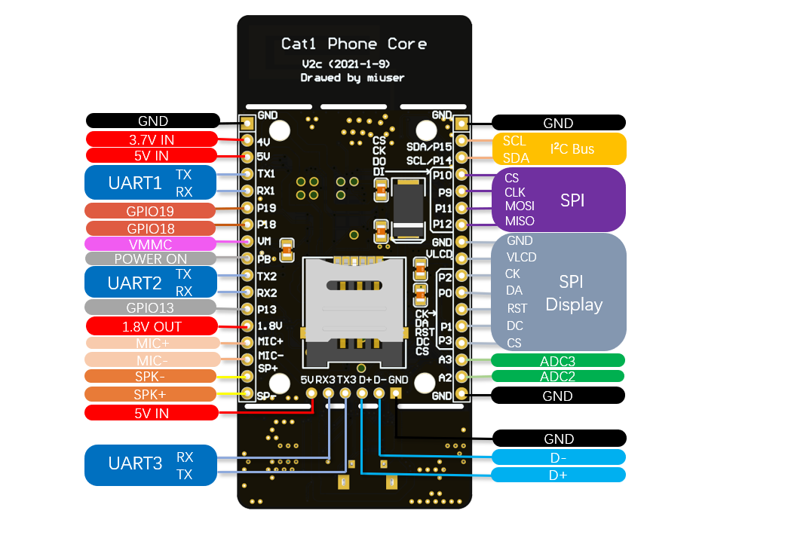

# midemo产品说明书

## 软件说明

### 版本 V0.2

本demo集源于上海合宙官方技术团队的DEMO（MIT），并参考了合宙开源社区的众多大佬无私分享的代码，包括但不限于 稀饭放姜、Wendal、晨旭、陈夏等

目前参考到的开源项目有： iRTU（MIT)、LuatOS(MIT)、LLCOM

欲获取更多luat 代码请访问 doc.openluat.com

如果您觉得本demo集包含了未经由您授权的代码，请联系 64034373@qq.com，如有侵权嫌疑将立即纠正

## 1 项目地址

https://gitee.com/miuser00/midemo

## 2 功能

midemo 计划用一组极简单的AT增强指令，简化现有的物联网模块联网方式，并增强现有物联网模块对外设的控制能力。 具体功能如下：

一、内置upws开源网络通讯组件，可以通过手机扫描二维码直接与模块建立通讯，收发指令

二、使用LED（网络占用GPIO4，电源灯占用GPIO5）或 128X32 0.91英寸微型点阵显示屏（可选，使用I2C总线）展示联网状态

三、支持外挂320X240分辨率以下的SPI全彩显示屏和扬声器进行文字信息输出

四、支持指令控制实时外挂各种总线设备，包括传感器，执行器等，兼容SPI、UART两种总线连接方式

五、支持定时指令控制

六、支持多链路连接并自动维护网络持续可用，目前支持三路同时在线，1、upws（默认内置），2、标准MQTT，3、阿里云透传

七、支持远程恢复和固件升级

## 3 使用方法

推荐使用开源电话核心板Cat1 Phone Core 作为硬件平台，项目地址：https://www.oshwhub.com/miuser/elderphonev2-schdoc，开发板成品即将在淘宝店开售，使用合宙官方开发板亦可使用本项目。

一、连接USB端口，安装好驱动程序，然后使用LuatoolsV2 将项目源码（midemo目录及子目录）全部烧写到目标的核心板

二、运行二维码生成程序 tools\Module_Print\M2MReader\bin\Debug\M2MReader.exe，生成遥控二维码并通过手机扫描控制

三、使用LLCOM连接USB虚拟AT串口（名称为：LUAT USB Device 1 AT COMXX)，进行控制

## 4 基本术语

midemo的一切功能均通过指令和消息完成，指令被称为MAT，消息被称为MATR

	MAT 指令 --指用户发送给midemo的指令，全称为 Miniums Attention 
	MATR 消息--指midemo发送给用户的消息，全称为 Minimus Attention Respond

MAT和MATR采用GB2312编码，且均可以携带任意个参数，参数之间采用英文字符逗号"," 分隔，在参数和命令中逗号为保留字符禁止使用，如果确有需要，以中文逗号代替，中文逗号则用两个连续的中文逗号代替。

## 5 工作原理

midemo基于上海合宙luatask架构编写，使用iRTU开源物联网固件作为通讯内核，各个模块采用协作式多任务（协程）方式进行通讯。 模块拥有全球唯一的ID识别码，和唯一的MM通讯密码。 ID+MM方式实现双向收发鉴权，仅ID方式适用于单向侦听网络包，但无权发送。 ID和MM可以通过二维码生成器生成，并将在模块上电时从串口打印输出。

## 6 项目结构

### 6.1 遥控端文件 （app目录）

	<dir> CS_UDP_demo	--C#编写的模块控制程序demo，支持通过本地串口和网络UDP方式访问upws接口控制模块
	<dir> page			--html5编写的模块控制页面，跨平台支持PC、手机、平板上的各种浏览器、微信扫一扫等

### 6.2 源码文件（source目录）

	main.lua 	--入口文件
	bs.lua				--midemo模块配置文件
	<dir> LICENSE		--版权信息
	<dir> iRTU			--网络通讯组件包
	<dir> midemo_core 	--项目核心文件
	<dir> midemo_ext	--第三方编写的模块（含样例）
	<dir> midemo_media  --项目媒体，如声音图片等

### 6.3 小工具 （tool目录）

	<dir> 外标签打印程序	--外标签二维码打印程序
	<dir> Module_Printer--模块访问二维码打印程序

## 7 使用方法

上电后，有三种方式可以控制模块。 推荐前两种方式！

1，通过手机扫描使用工具生产的二维码。 

2，使用本地USB虚拟AT串口访问模块。 

3使用附带的C#demo通过UDP方式访问模块。 

本DEMO采用标准的AT方式进行通讯。

举例：

	SETGPIO,13,1 		-> 设置GPIO13位高电平
	SETGPIO,13,1->OK	<- midemo回送通讯正常
	GPIOLEVEL,13,1		<- midemo回送当前GPIO13电平状态为高
	GPIOEDGE,13,1		<- midemo回送GPIO13上升沿触发状态

## 8 二次开发接口

您可以参考midemo_ext目录提供的demo.lua构建您的传感器或者执行器控制代码。 只需遵循一些基本原则，您的代码就可以与midemo框架共享本地硬件资源和网络接口，而不至发生干涉。 

### 8.1 编写方式

	--------------------------------------------------------------------
	--                                                                 -
	--                           三方模块加载表                          -
	--                                                                 -
	--------------------------------------------------------------------
	--外部模块DEMO
	require "XXX"  --此处是您需要添加的代码
	require "demo"
	
1. 在midemo_ext目录中新建一个XXX.lua的文件，XXX为您要编写的模块名
2. 在bs.lua中的此处添加您的模块引用

### 8.2 接口工作方式

第一步：通过sys.subscribe响应您要设立的AT指令，本例中指令名为为DOWORK

	--通过这个回调函数可以响应任意的串口或网络发布的命令
	sys.subscribe("DOWORK",function(...)
	    --通过arg可以从输入的命令行读入参数，并以逗号作为分隔符
	    --a=arg[1]
	    --b=arg[2]
	    --c=arg[3]
	    --通过write函数可以向串口和网络上报您的信息
	    write("您刚刚执行了DWORK命令，".."命令共有"..#arg.."个参数".."\r\n")
	end)

第二步：通过调用write函数，向本地COM口和网络接口发送指令执行后的回送信息

	--通过消息发送调试信息到串口和网络客户端
	function write(s)
	    --log.info("testUartTask.write",s)
	    sys.publish("COM",s)
	    sys.publish("NET_CMD_MONI",s)
	end

### 8.3 常用的系统消息

	COM					--向AT串口发送字符串消息
	NET_CMD_MONI 		--向网络接口发送字符串消息
	DISPLAY				--向OLED显示屏投送一行字符串

### 8.4 推荐编写原则 

在进行模块编写时，建议遵循以下的原则。

1. 仅申请必要的硬件资源，使用资源完成后立即释放，并在使用前后使用log.info发布相关资源占用情况信息
2. 确实需要独占硬件的，应在上电时通过AT串口输出占用情况，并提供释放硬件资源的调用接口
3. 全局配置表仅有一个名为“midemo”，记录midemo的开机配置信息保存在midemo.bs中，通过Lutask消息收发传递命令
4. 全局状态表仅有一个名为“status”，定义midemo运行的状态信息保存在status.bs中

### 9 作者联系方式

QQ: 64034373

Bilibili: 懒懒笨笨

doc.openluat.com: miuser

有不清楚的地方请随时与我联系。
