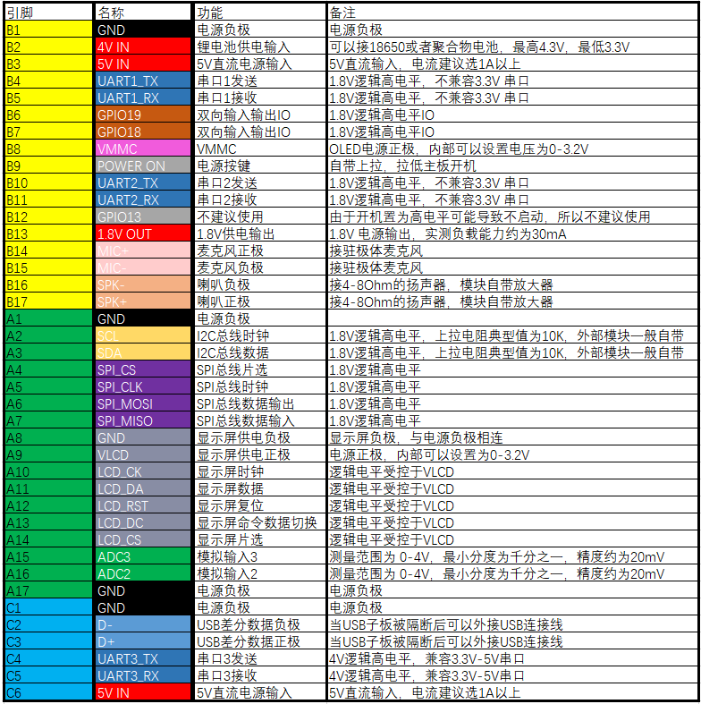
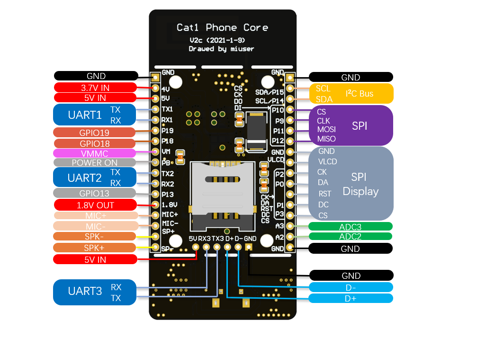
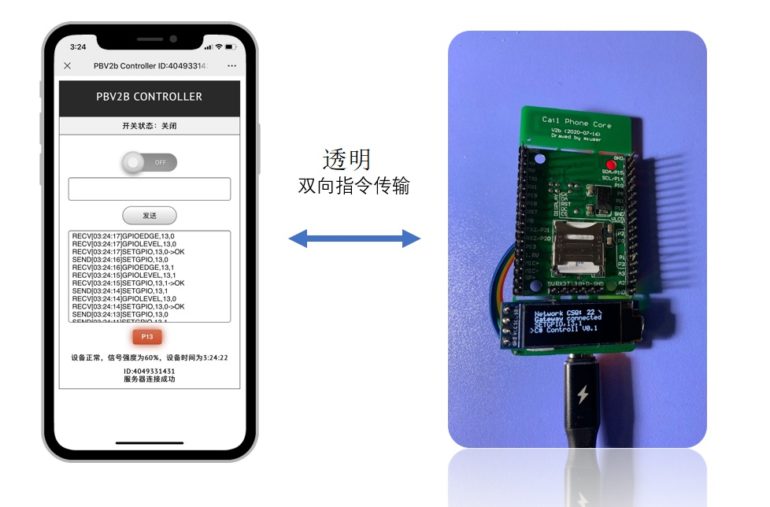

# Cat1 核心板功能简介

## 产品简介：
合宙Air724 Cat1电话核心板基于Air724模组，支持电话二次开发，板载sim卡座，4G天线，是目前尺寸最小，且板载天线的全功能cat1核心板

## 产品功能

纯4G全网通，支持移动、联通、电信手机卡及物联网卡

I2C总线支持，支持SSD1306OLED显示屏，SHT20，AM2320等温湿度传感器，加速度传感器MPU6050等

SPI总线支持，支持RC522IC卡等各种SPI设备

显示接口，支持SSD1306，ST7735，IL9341，ST7789等多款全彩显示屏

三路串口输出，

GPIO最多可达13个

板载两路10位ADC

支持 4GVolte 打电话功能

支持 各种主流云透传支持，提供PC、手机 控制端，模块固件 等 并全部开源

内置软件看门狗

支持MP3播放

支持TTS文本转语音功能

## 电路参数：

工作电压为USB5V供电或者外接5V插针供电。

UART1，2 为 1.8V电平，兼容3.3V电平。 UART3为4V电平，兼容3.3V和5V电平。

IO电平为1.8V，部分IO口电平可调

1.8V，I2C SPI接口

内置天线，兼容ipex插座

## 外形尺寸:

全尺寸（含板载天线和USB调试尾插）
74mmx35mmX6mm(长X宽X高)
 
核心尺寸（不含天线和USB调试尾插）
45mmX35mmx6mm(长X宽X高) 

## 软件特点

1）内置稀饭放姜iRTU开源透传组件

2）内置upws开源云服务器

3）手机html5+websocket通信客户端开源

基于原生H5技术的免安装APP控制，可以通过手机远程收发指令，通过扫码遥控开发板。

基于最新开发中的mi-demo，使您无需编写代码，也无需使用其他中间服务器，既可以轻松完成多数物联网功能

软硬件设计图纸，代码等均开源。 

提供核心板成品和套件两种形式的产品，零门槛开始物理网开发。

